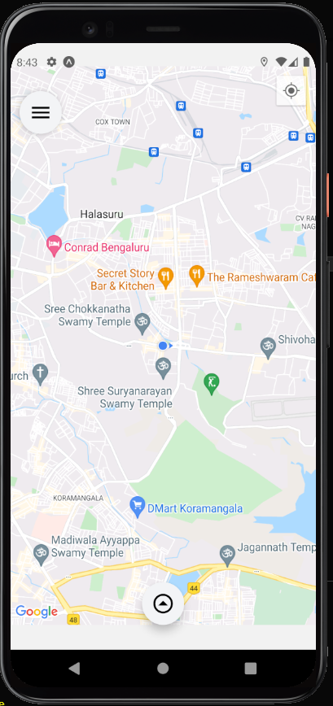
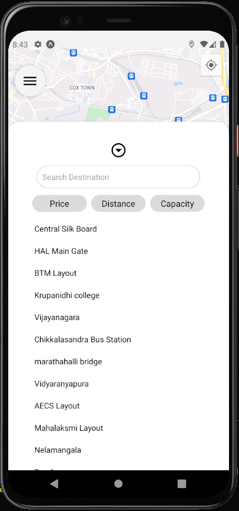
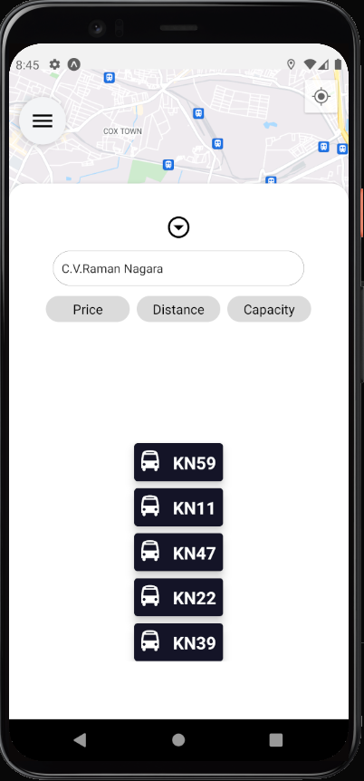
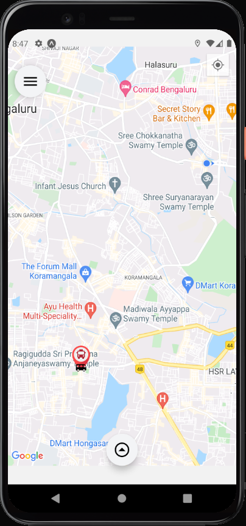
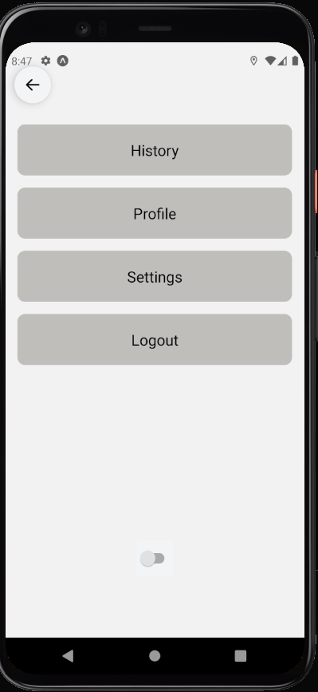
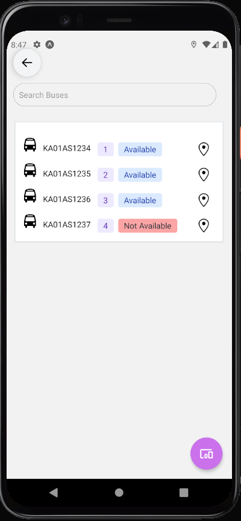
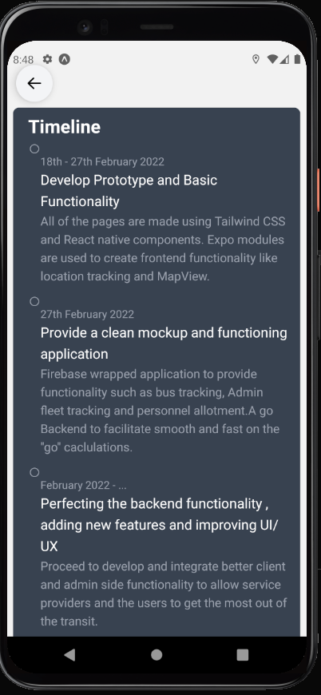

## Speed, wisdom and Efficiency.
A fleet management Application built with the service providers and user in mind. A multi faceted Admin and consumer console application for mobile.

The application aims to aid the tracking of buses in a fleet, we have taken the example of the BMTC, The consumer is able to choose their destination and is referred to a best course to reach that destination using BMTC buses, based on bus capacity, location and availability.

The admin/Fleet manager is able to track the entire convoy of buses , with availability status, Seat capacity, Maintenance requirements, Breakdown checks, etc.

### Feature List
- Maintenance warnings
- Route setting
- Realtime Bus Tracking (_~1min_)
- Seat capacity

### Technologies used:
- React Native
- Expo CLI
- Expo adjoint system call libraries (***location***)

### Map Home :


## Map with destination Modal:


## Map with price sorted buses:



## Map with Bus Tracking Ping:


## Main Menu Screen:


## Main Admin Menu:


## Fleet Console:


## Admin Console:


## Timeline:


```
Note:
- To run the application on a device , Google maps API key is required.
```