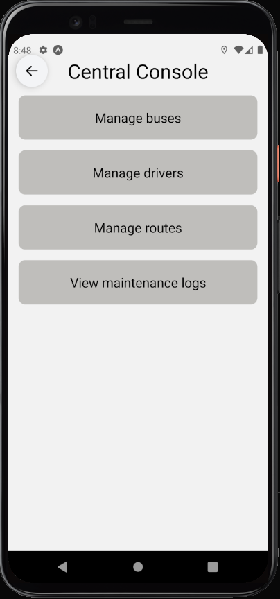

## Speed, wisdom and Efficiency.
A fleet management Application built with the service providers and user in mind. A multi faceted Admin and consumer console application for mobile.

The application aims to aid the tracking of buses in a fleet, we have taken the example of the BMTC, The consumer is able to choose their destination and is referred to a best course to reach that destination using BMTC buses, based on bus capacity, location and availability.

The admin/Fleet manager is able to track the entire convoy of buses , with availability status, Seat capacity, Maintenance requirements, Breakdown checks, etc.

### Feature List
- Maintenance warnings
- Route setting
- Realtime Bus Tracking (_~1min_)
- Seat capacity

### Technologies used:
- React Native
- Expo CLI
- Expo adjoint system call libraries (***location***)

## Note: **To run our application in an built APK format we would need a Google maps API key.**
### Steps to run the application
```
1. Run expo install in the ./App path inside the project root
2. Once everything is installed , run expo start to run the project cli
3. Connect expo to your android mobile phone using the Expo Go application or use a local emulator setup in android Studio.
4. Begin using the application based on your real location (physical device) or use an emulator with locations set in Bangalore.
5. Choose your destination using the map destination modal which can be opened using the bottom at the bottom of the map screen
6. Proceed to choose a destination and sort buses based on 3 parameters: Price, Distance or Capacity. You will be given a sorted list of current running buses (Simulated in our application) and can choose a bus of your choice to track on the map, all of which go to your destination.
7. The bus can be seen on the map and be interacted with.
8. The burger button on the top right can be used to bring up the general user menu and can be switched to admin view using the switch at the bottom of the page.
9. The Admin menu page provides a Speed Dial in the bottom right which can be used to access the admin console, fleet console, and project Timeline.
10. The fleet Console is used to track the buses in the fleet with status, capacity, route no, etc.
11. The admin console is the total overview on the fleet management side.
12. The timeline screen specifies our working objectives and plans over the project production lifecycle.
```
### Map Home :


## Map with destination Modal:


## Map with price sorted buses:


## Map with Bus Tracking Ping:


## Main Menu Screen:


## Main Admin Menu:


## Fleet Console:


## Admin Console:


## Timeline:


```
Note:
- To run the application on a device , Google maps API key is required.
```
